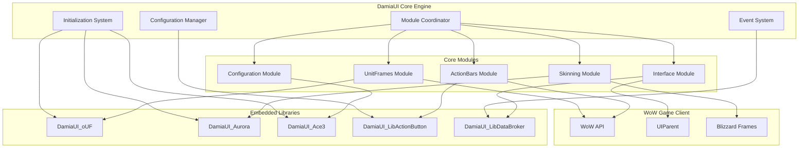

# Design Document

## Overview

Damia UI is architected as a modular, self-contained World of Warcraft addon that provides complete interface replacement through a centered, symmetrical layout philosophy. The design emphasizes viewport-first principles, embedding all required dependencies to ensure zero external requirements while maintaining professional-grade performance and aesthetics.

The system follows a layered architecture with a core engine managing embedded libraries (oUF, Aurora, Ace3, LibActionButton), coordinating specialized modules for unit frames, action bars, interface elements, and skinning. This design ensures maintainability, performance optimization, and seamless user experience across all supported resolutions and game scenarios.

## Architecture

### System Architecture



### Module Interaction Design

The architecture implements a hub-and-spoke pattern where the Core Engine acts as the central coordinator, managing communication between specialized modules through a standardized event system. Each module operates independently but can communicate through the central event dispatcher, ensuring loose coupling and high cohesion.

**Core Engine Responsibilities:**
- Library namespace isolation and conflict prevention
- Module lifecycle management (initialization, configuration, shutdown)
- Event routing and priority-based execution
- Performance monitoring and optimization
- Error handling and recovery coordination

**Module Isolation Strategy:**
Each module maintains its own namespace and state, communicating only through defined APIs and events. This prevents cross-module dependencies and enables independent testing and development.

### Embedded Library Management

The design implements a sophisticated library embedding strategy that prevents conflicts with standalone versions while providing full functionality:

**Namespace Isolation Pattern:**
```lua
-- Each embedded library gets unique namespace
DamiaUI.Libraries = {
    oUF = DamiaUI_oUF,
    Aurora = DamiaUI_Aurora,
    Ace3 = DamiaUI_Ace3,
    LibActionButton = DamiaUI_LibActionButton,
    LibDataBroker = DamiaUI_LibDataBroker
}
```

**Conflict Resolution:**
- Priority system favors embedded versions for DamiaUI modules
- Graceful fallback to standalone versions when available
- Version compatibility checking and warnings
- Safe loading order with dependency validation

## Components and Interfaces

### Core Engine Component

**Initialization System:**
- Sequential library loading with dependency validation
- Module registration and capability detection
- Configuration migration and validation
- Performance baseline establishment

**Configuration Manager:**
- Profile-based settings with inheritance
- Real-time validation and constraint checking
- Atomic configuration updates with rollback capability
- Settings persistence with corruption recovery

**Event System:**
- Three-tier event handling (WoW events, custom events, configuration events)
- Priority-based callback execution
- Event throttling and batching for performance
- Combat lockdown aware event queuing

### UnitFrames Module

**Design Philosophy:**
Implements oUF-based unit frames with perfect symmetrical positioning around screen center, providing immediate visual balance and optimal information accessibility.

**Core Components:**
- **Frame Factory:** Creates and configures oUF frames with consistent styling
- **Position Calculator:** Handles center-based coordinate system with scale awareness
- **Element Manager:** Manages health bars, power bars, text elements, and status indicators
- **Animation Controller:** Handles combat transitions and visual feedback

**Frame Positioning Algorithm:**
```lua
-- Center-based coordinate system
function CalculateFramePosition(frameType, customOffset)
    local basePositions = {
        player = { x = -200, y = -80 },
        target = { x = 200, y = -80 },
        focus = { x = 0, y = -40 }
    }
    
    local screenCenter = GetScreenCenter()
    local uiScale = GetUIScale()
    local position = basePositions[frameType]
    
    return {
        x = (screenCenter.x + position.x + (customOffset.x or 0)) / uiScale,
        y = (screenCenter.y + position.y + (customOffset.y or 0)) / uiScale
    }
end
```

### ActionBars Module

**Design Philosophy:**
Provides symmetrical action bar layout centered at screen bottom, maintaining visual balance while ensuring efficient ability access and muscle memory preservation.

**Core Components:**
- **Bar Manager:** Creates and positions action bars with LibActionButton integration
- **Button Factory:** Generates action buttons with consistent styling and behavior
- **Layout Calculator:** Handles symmetrical positioning with configurable spacing
- **State Manager:** Manages button states, cooldowns, and combat lockdown

**Symmetrical Layout Algorithm:**
```lua
function CalculateBarLayout(buttonCount, buttonSize, spacing)
    local totalWidth = (buttonCount * buttonSize) + ((buttonCount - 1) * spacing)
    local startOffset = -totalWidth / 2 + buttonSize / 2
    
    local positions = {}
    for i = 1, buttonCount do
        positions[i] = {
            x = startOffset + (i - 1) * (buttonSize + spacing),
            y = 0
        }
    end
    
    return positions
end
```

### Interface Module

**Design Philosophy:**
Manages peripheral interface elements (chat, minimap, information panels) positioned strategically to provide essential information without cluttering the central viewport.

**Core Components:**
- **Chat Manager:** Handles chat frame positioning, styling, and tab management
- **Minimap Controller:** Manages minimap positioning, scaling, and button integration
- **Information Panels:** Displays real-time data through LibDataBroker integration
- **Buff/Debuff Display:** Shows auras with intelligent filtering and positioning

### Skinning Module

**Design Philosophy:**
Applies consistent Aurora dark theme across all UI elements, including Blizzard frames and third-party addons, ensuring visual cohesion throughout the interface.

**Core Components:**
- **Aurora Integration:** Manages Aurora library initialization and configuration
- **Frame Monitor:** Detects new frame creation and applies appropriate skinning
- **Blizzard Skinner:** Handles all default WoW interface elements
- **Third-Party Detector:** Identifies and skins compatible addon frames

**Skinning Application Strategy:**
```lua
-- Delayed skinning to avoid initialization conflicts
function ApplySkinning()
    -- Phase 1: Core DamiaUI frames
    SkinDamiaUIFrames()
    
    -- Phase 2: Blizzard frames (delayed)
    C_Timer.After(0.5, SkinBlizzardFrames)
    
    -- Phase 3: Third-party detection (ongoing)
    RegisterFrameMonitoring()
end
```

### Configuration Module

**Design Philosophy:**
Provides intuitive configuration interface with live preview, organized settings hierarchy, and robust profile management to enable customization without complexity.

**Core Components:**
- **AceConfig Integration:** Builds configuration GUI with organized option trees
- **Profile Manager:** Handles multiple configuration profiles with easy switching
- **Live Preview:** Applies changes immediately with rollback capability
- **Settings Validator:** Ensures configuration integrity and constraint compliance

## Data Models

### Configuration Data Structure

```lua
DamiaUIDB = {
    version = "1.0.0",
    
    -- Character-specific data
    char = {
        [realmName] = {
            [characterName] = {
                currentProfile = "Default",
                firstLogin = timestamp,
                lastLogin = timestamp
            }
        }
    },
    
    -- Account-wide profiles
    profiles = {
        ["Default"] = {
            unitframes = {
                player = {
                    enabled = true,
                    position = { x = -200, y = -80 },
                    scale = 1.0,
                    width = 200,
                    height = 50,
                    elements = {
                        health = { enabled = true, height = 22 },
                        power = { enabled = true, height = 12 },
                        name = { enabled = true, font = "Expressway", size = 14 },
                        level = { enabled = true, font = "Expressway", size = 10 }
                    }
                },
                target = {
                    enabled = true,
                    position = { x = 200, y = -80 },
                    scale = 1.0,
                    width = 200,
                    height = 50,
                    elements = {
                        health = { enabled = true, height = 22 },
                        power = { enabled = true, height = 12 },
                        name = { enabled = true, font = "Expressway", size = 14 },
                        level = { enabled = true, font = "Expressway", size = 10 },
                        castbar = { enabled = true, height = 8 }
                    }
                },
                focus = {
                    enabled = true,
                    position = { x = 0, y = -40 },
                    scale = 0.8,
                    width = 160,
                    height = 40
                }
            },
            
            actionbars = {
                mainbar = {
                    enabled = true,
                    position = { x = 0, y = -250 },
                    buttonSize = 36,
                    buttonSpacing = 4,
                    buttonCount = 12,
                    showKeybinds = true,
                    showCooldowns = true
                },
                secondarybar = {
                    enabled = false,
                    position = { x = 0, y = -210 },
                    buttonSize = 32,
                    buttonSpacing = 4,
                    buttonCount = 12
                }
            },
            
            interface = {
                chat = {
                    enabled = true,
                    position = { x = -400, y = -200 },
                    width = 350,
                    height = 120,
                    tabs = { "General", "Combat", "Whisper" }
                },
                minimap = {
                    enabled = true,
                    position = { x = 200, y = 200 },
                    scale = 1.0,
                    shape = "square"
                },
                infopanels = {
                    enabled = true,
                    position = { x = 200, y = -200 },
                    width = 180,
                    height = 100,
                    dataSources = { "fps", "memory", "ping", "coordinates" }
                }
            },
            
            skinning = {
                enabled = true,
                blizzardFrames = true,
                thirdPartyFrames = true,
                customColors = {
                    background = { r = 0.1, g = 0.1, b = 0.1, a = 0.95 },
                    border = { r = 0.31, g = 0.31, b = 0.31, a = 1.0 },
                    accent = { r = 0.78, g = 0.47, b = 0.12, a = 1.0 }
                }
            }
        }
    },
    
    -- Global settings
    global = {
        minimap = { hide = false, minimapPos = 220 },
        firstInstall = timestamp,
        migrations = {}
    }
}
```

### Event Data Models

```lua
-- Core events with standardized data structures
Events = {
    DAMIA_INITIALIZED = {
        timestamp = number,
        version = string,
        loadTime = number
    },
    
    DAMIA_CONFIG_CHANGED = {
        key = string,
        oldValue = any,
        newValue = any,
        profile = string
    },
    
    DAMIA_COMBAT_STATE_CHANGED = {
        inCombat = boolean,
        timestamp = number
    },
    
    DAMIA_SCALE_CHANGED = {
        newScale = number,
        oldScale = number,
        source = string -- "user", "resolution", "auto"
    }
}
```

## Error Handling

### Error Classification System

**Error Severity Levels:**
1. **Critical:** Complete addon non-functionality requiring immediate intervention
2. **Major:** Important features broken but core functionality remains
3. **Minor:** Limited feature impact with workarounds available
4. **Cosmetic:** Visual issues only, no functional impact

### Error Recovery Strategies

**Critical Error Recovery:**
```lua
function HandleCriticalError(error)
    -- Immediate safe mode activation
    ActivateSafeMode()
    
    -- Error logging with full context
    LogError("CRITICAL", error, GetStackTrace())
    
    -- User notification with recovery options
    ShowRecoveryDialog({
        "Reset to Default Settings",
        "Reload UI with Last Known Good Configuration", 
        "Continue in Safe Mode",
        "Disable Addon"
    })
    
    -- Automatic recovery attempt after timeout
    C_Timer.After(30, AttemptAutoRecovery)
end
```

**Graceful Degradation:**
- Performance degradation triggers automatic optimization
- API compatibility issues enable fallback implementations
- Library conflicts activate alternative code paths
- Memory pressure initiates aggressive cleanup

**Recovery Mechanisms:**
- Configuration rollback to last working state
- Module isolation to prevent cascade failures
- Safe mode with minimal functionality
- Automatic error reporting and diagnostics

### Combat Lockdown Handling

**Protected Action Management:**
```lua
local pendingActions = {}

function ExecuteProtectedAction(action, ...)
    if InCombatLockdown() then
        -- Queue for post-combat execution
        table.insert(pendingActions, {
            action = action,
            args = {...},
            timestamp = GetTime()
        })
        return false, "Queued for post-combat"
    else
        return action(...)
    end
end

-- Post-combat execution
RegisterEvent("PLAYER_REGEN_ENABLED", function()
    for _, queuedAction in ipairs(pendingActions) do
        pcall(queuedAction.action, unpack(queuedAction.args))
    end
    wipe(pendingActions)
end)
```

## Testing Strategy

### Unit Testing Framework

**Test Categories:**
1. **Core Engine Tests:** Initialization, configuration, event handling
2. **Module Tests:** Individual module functionality and integration
3. **Performance Tests:** Memory usage, FPS impact, load times
4. **Compatibility Tests:** Multi-resolution, addon conflicts, WoW versions

**Testing Infrastructure:**
```lua
local TestFramework = {
    tests = {},
    results = {},
    
    RegisterTest = function(name, testFunc, category)
        table.insert(tests, {
            name = name,
            func = testFunc,
            category = category
        })
    end,
    
    RunTests = function(category)
        for _, test in ipairs(tests) do
            if not category or test.category == category then
                local success, result = pcall(test.func)
                results[test.name] = {
                    success = success,
                    result = result,
                    timestamp = GetTime()
                }
            end
        end
    end
}
```

### Integration Testing

**Multi-Resolution Testing:**
- Automated testing across 1080p, 1440p, 4K resolutions
- Ultra-wide display compatibility verification
- UI scale factor validation
- Element positioning accuracy checks

**Performance Benchmarking:**
- FPS impact measurement in various scenarios
- Memory usage profiling over extended sessions
- Load time optimization validation
- Event handling performance testing

**Compatibility Testing:**
- Popular addon combination testing
- Blizzard UI update compatibility
- Third-party library conflict detection
- Cross-realm and cross-faction functionality

This design provides a robust foundation for implementing Damia UI as a professional-grade World of Warcraft addon that meets all performance requirements while delivering the classic centered layout experience with modern standards and reliability.